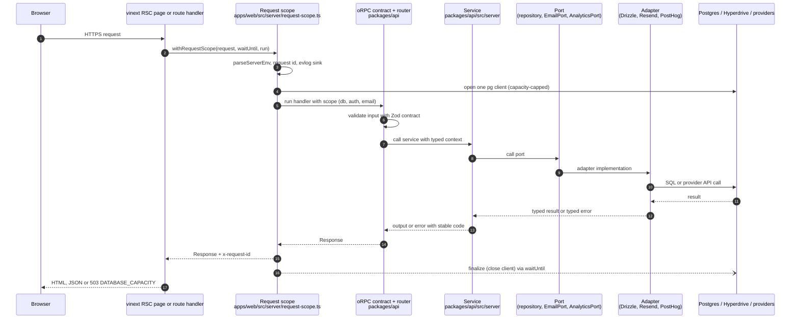
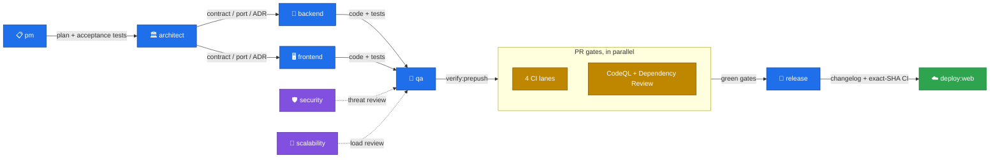
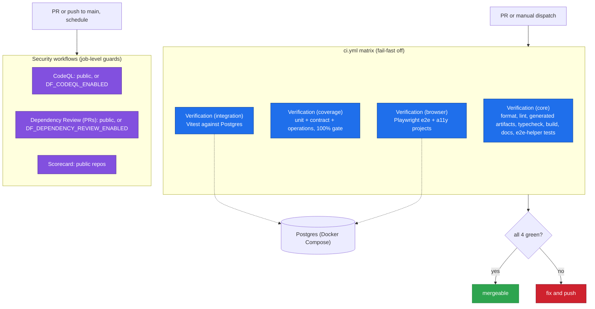

# Architecture

DarkFactory is a pnpm + Turborepo workspace of small packages ("bricks"). Apps compose bricks. Bricks expose narrow `exports` maps and never import apps. External services are reached only through ports, and each port has an adapter.

## Brick map

Every workspace `package.json` declares a `brick` role. The live per-package graph, with every workspace dependency and export, is generated from those files: **[docs/generated/package-graph.md](docs/generated/package-graph.md)**. `bun run docs:check` (part of `verify:prepush` and the core CI lane) fails when that graph is stale, a package has no valid role, or a dependency breaks the role rules.

| Role | Packages | Boundary |
| --- | --- | --- |
| `app` | `apps/web` | Composition root: pages, route handlers, request scope. No business rules. |
| `product` | `api`, `auth`, `db`, `config`, `observability`, `ui`, `state` | Contracts and services, Better Auth, Drizzle, env and capability manifest, telemetry and events, presentational UI, state machines. |
| `capability` | `email`, `analytics`, `ai` | One port, its adapters and an adapter-id registry (`./adapters`). Depends on no other brick. |
| `agent-sdlc` | `apps/operator`, `packages/operator`, `packages/jobs` | The opt-in operator plane ([docs/operator.md](docs/operator.md)). Nothing in the product depends on it. |
| `tooling` | `testkit` | Isolated Postgres databases for tests. |
| `workspace` | root `package.json` | Scripts and shared dev tooling. |

Role rules, enforced by `ALLOWED_BRICK_DEPENDENCIES` in `scripts/docs/docs.ts`:

- Nothing depends on an app, so an app can be deleted or replaced alone.
- Capability bricks depend only on tooling. `config` imports their adapter-id registries to build its env and manifest enums, so removing a capability also means removing its enum and env keys from `packages/config`.
- Product bricks never depend on the agent plane, so `apps/operator`, `packages/operator` and `packages/jobs` can be deleted together.

Other boundary rules:

- Server-only code sits behind a `./server` or `./server/<name>` export. Its `browser` condition resolves to an `unsupported` stub that throws, so a server module cannot be bundled into client code by accident.
- Vendor SDKs are imported only in adapter files (`resend` in `packages/email/src/server/`, OpenTelemetry exporters in `packages/observability/src/server/otel.ts`); `pg` only in `packages/db` and `packages/testkit`. PostHog and Groq adapters call their HTTP APIs with an injectable `fetch`.

## Request flow

Each database-backed Worker request (auth, strict sign-out and oRPC routes) opens exactly one request scope. The scope parses the environment, resolves the request id, opens one database client (directly or through Hyperdrive), and builds the email port and the auth instance. When the response is ready it schedules cleanup with `waitUntil`. Server-rendered pages call the auth and oRPC handlers in-process (`apps/web/src/lib/server-internal-dispatch.ts`), so they go through the same scope and contracts as browser calls and share the page's request id.

## SDLC agent graph

Each role hands the next one an artifact (the edge labels). Security and scalability review the code beside qa; CI lanes and security scans run side by side as PR gates. Any agent harness can follow this; the opt-in operator plane can run it with approvals. Role playbooks are in [`.agents/skills/`](.agents/skills/) (linked from [AGENTS.md](AGENTS.md#agent-roles)).

## CI lanes

`ci.yml` runs on `pull_request` and `workflow_dispatch` only, never on push. Each lane runs one root script, `bun run verify:<lane>`, where core runs `verify:core:ci`. The four check names are the required checks.

CodeQL runs on PRs to `main`, pushes to `main` and weekly. Dependency Review runs on PRs to `main`. Scorecard runs on pushes to `main`, weekly and on branch-protection changes. None of them run on manual dispatch.

## Why it is wired this way

- **Contracts are the source of truth.** An oRPC contract (`packages/api/src/contracts/*.ts`) defines input, output and error codes once. The router, typed client and `packages/api/openapi.json` all come from it, and `openapi:check` fails when the generated file drifts.
- **Headless data, separate presentation.** Contracts, services and state machines (`packages/state`) are UI-free, and `packages/ui` declares no workspace dependencies, so its components only render props. A page loads data through a contract, a view-model maps the output to plain, pre-formatted props, and a component renders only that model. The dashboard is the reference: `apps/web/src/app/(portal)/dashboard/page.tsx` loads `dashboard.summary`, `apps/web/src/features/dashboard/view-model.ts` turns it into labels, counts and an `unavailable` state (unit-tested without a DOM), and `DashboardContent` renders the result. You can restyle UI without touching data and reuse one contract from pages and external OpenAPI clients.
- **Ports keep vendors replaceable.** Services depend on interfaces such as `EmailPort` and `AnalyticsPort`, and the app chooses the adapter from env. Swapping a provider changes an adapter, a registry entry and its env keys; features do not change ([docs/capabilities.md](docs/capabilities.md)).
- **One request scope.** One factory gives every database-backed handler the same lifecycle, capacity-error mapping and request id, instead of each handler assembling env, database, email and auth itself and drifting.
- **One connection cap, plus Hyperdrive.** A Worker opens one `pg` client per request. `REQUEST_DATABASE_POOL_MAX_CONNECTIONS` in `packages/db/src/server/client.ts` caps concurrent clients per isolate and fails fast with a 503. Hyperdrive, when enabled, pools connections at the edge without changing that code path.
- **Fail closed.** `parseServerEnv` rejects invalid or unsafe production config (local hosts, missing TLS, development secrets, preview email) before a request is served. Unsupported platforms and missing bindings throw instead of degrading silently.
- **The agent plane is optional.** Its schema, repository and runtime live in `packages/jobs` and `packages/operator`. The product builds, tests and deploys without them.
- **Gates prove behavior, not bytes.** The 100% coverage gate plus an invariant on the measured file set replaces committed coverage totals. Generated docs are derived from source and checked, not hand-maintained. PR "done" means four green lanes; exact-SHA proof is only required when shipping.

## Decisions

| ID | Decision | Why |
| --- | --- | --- |
| ADR-001 | Deploy the web app only with `@vinext/cloudflare`. Alchemy may own only a real, enabled ancillary resource; there is no empty `alchemy.run.ts`. | An empty Alchemy program can delete persisted resources. Full record: [docs/adr/0001-vinext-alchemy-boundary.md](docs/adr/0001-vinext-alchemy-boundary.md) |
| ADR-002 | Author everything in strict TypeScript, with the toolchain (Node, Bun for scripts, pnpm) pinned in `mise.toml`. | One language that CodeQL, Biome and every agent harness understand; no compile-to-TypeScript step. |
| ADR-003 | All application API access goes through oRPC contracts, with generated OpenAPI. | One typed contract for pages, apps and external clients. |
| ADR-004 | Postgres through Drizzle only. No Redis, queue or second data store by default. | One source of truth; Postgres features before new infrastructure. |
| ADR-005 | Ports and adapters for every external service; SDK imports only in adapters; `unsupported` browser stubs for server exports. | Swappable providers and bundle safety. |
| ADR-006 | One request-scope factory per database-backed Worker request. | One place for capacity errors, request ids and cleanup. |
| ADR-007 | `DATABASE_PROVIDER` is `postgres`, `planetscale` or `hyperdrive`, each with its own validation profile. Hyperdrive is optional, with query caching disabled. | Provider-neutral production database; no stale session reads. |
| ADR-008 | `capabilities.yaml` is validated by one Zod loader (`packages/config/src/server/capabilities-loader.ts`) whose provider enums come from the adapter registries. `doctor` derives its probes from it. | One parser; the manifest cannot name code that does not exist. |
| ADR-009 | The operator plane is an opt-in brick. Workflow schema and repository live in `packages/jobs`; migrations 0005–0007 stay frozen in the product chain; new workflow DDL goes to `packages/jobs/migrations`. | Keeps agent tooling out of the product without destructive migrations. |
| ADR-010 | Packages without consumers are deleted; `ai` is the reference capability brick. | No dead bricks. |
| ADR-011 | CI runs 4 required lanes on PRs and manual dispatch only; security workflows use job-level guards; exact-SHA evidence only for release and deploy. | Removes duplicate runs and endless re-verification. |
| ADR-012 | Coverage: 100% thresholds plus a measured-file-set invariant; no committed totals. | Guards the denominator without a file that churns on every commit. |
| ADR-013 | E2E uses Playwright built-ins: `webServer` (portless proxy + production app), `globalSetup` (migrate and seed), `e2e` and `a11y` projects, SPKI-pinned CA trust, `retries: 1` with `failOnFlakyTests` in CI. | No custom harness to maintain; no TLS bypass. |
| ADR-014 | `bun run setup` is the only bootstrap, and the Zod env schema is the only env contract. | Fewer prerequisites; one fail-closed contract. |
| ADR-015 | Every workspace package declares a `brick` role; `docs:generate` derives the package graph and `docs:check` enforces role dependency rules. | Lego-brick boundaries are traceable and the architecture diagram cannot go stale. |
