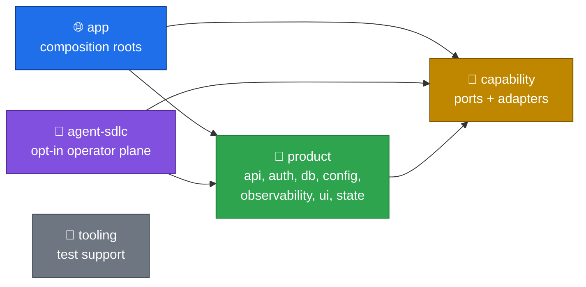

<!-- markdownlint-disable-next-line MD041 -->


# DarkFactory

[](https://github.com/jeffscottward/darkfactory/actions/workflows/ci.yml?query=event%3Apull_request)
[](https://github.com/jeffscottward/darkfactory/actions/workflows/codeql.yml)
[](https://github.com/jeffscottward/darkfactory/releases/latest)
[](LICENSE)
[](https://www.bestpractices.dev/projects/13782)
[](vitest.config.ts)

DarkFactory is a strict-TypeScript monorepo template for starting a web product with the boring parts already wired. It ships Next App Router pages on Vite (vinext) deployed to Cloudflare Workers, PostgreSQL through Drizzle, contract-first oRPC with generated OpenAPI, Better Auth, and Tailwind + shadcn UI.

Every external service (email, analytics, AI, telemetry) sits behind a small port with an adapter, so you swap a provider by replacing an adapter, not by rewriting features. The database host is a config switch: plain Postgres, PlanetScale or Cloudflare Hyperdrive. Gates are strict: 100% coverage, four required CI lanes, and generated contracts and docs that must match the code. An optional operator plane runs a planned, approval-gated agent SDLC on top.

## Lego bricks

Every workspace package declares a `brick` role in its `package.json`. `bun run docs:check` enforces the direction of dependencies between roles:



Nothing depends on an app, capability bricks depend on nothing but tooling, and product bricks never reach into the agent plane. The per-package graph, with every workspace edge and export, is generated from the `package.json` files: **[docs/generated/package-graph.md](docs/generated/package-graph.md)**.

`ai` is the reference capability brick: a port, a Groq adapter, a recording fake and a browser guard, with no app wired to it yet. Copy its shape when you add a capability ([docs/capabilities.md](docs/capabilities.md)).

## Quickstart

You need [mise](https://mise.jdx.dev/), which installs the toolchain pinned in [`mise.toml`](mise.toml), and Docker for local Postgres (or your own PostgreSQL 17 with the roles in [`infra/docker/postgres.compose.yml`](infra/docker/postgres.compose.yml)).

```sh
git clone https://github.com/jeffscottward/darkfactory.git acme && cd acme
mise install
bun run setup
bun run dev
```

Open `https://darkfactory.localhost` and sign in as `admin@domain.test` with the development password `Development123!`. Details: [docs/getting-started.md](docs/getting-started.md).

<!-- init:start -->
### Start your own project

**Planned, not available yet.** A follow-up adds `bun run init`, which renames the template for a new project. Run it once, on a clean tree, before `bun run setup`:

```sh
bun run init -- --name <Name> --slug <slug> --scope @<scope> --domain <domain> [--repo <owner/repo>]
```

After `init`, the app runs at `https://<slug>.localhost`.
<!-- init:end -->

## Commands

| Command | What it does |
| --- | --- |
| `bun run setup` | Checks the toolchain, installs dependencies, writes `.env` with generated secrets, starts Postgres with Docker Compose, migrates, seeds dev accounts and writes the Worker `.dev.vars`. Safe to re-run. |
| `bun run dev` | Refreshes `.dev.vars` and starts the web app over portless HTTPS at `https://darkfactory.localhost`. |
| `bun run check` | Format check, lint (Biome and Markdown) and typecheck. |
| `bun run test` | Every suite: unit, contract, operations, integration, E2E and accessibility. |
| `bun run verify:prepush` | The pre-push hook: `check`, generated-artifact checks, and unit, contract and operations tests. |
| `bun run verify` | Runs the same checks as the four CI lanes, locally. |
| `bun run docs:generate` / `docs:check` | Regenerates or checks [docs/generated/package-graph.md](docs/generated/package-graph.md). |
| `bun run generate:feature <name>` | Generates a feature slice: table, migration, repository, contract, service, portal page, docs and tests. Add `--dry-run` to preview. |
| `bun run db:migrate` | Applies migrations. `db:seed` and `db:reset` also need `-- --confirm-environment=development`. |
| `bun run deploy:web:check` / `deploy:web` | Validates the production database config and dry-runs the Worker deploy, or deploys it ([docs/deploy.md](docs/deploy.md)). |
| `bun run doctor` | Checks the toolchain, required env keys and the services declared in `capabilities.yaml`. |
| `bun run graph:build` | Optional. Builds a local Graphify code graph for navigation. It is never committed. |

## Stack

Versions live in [`package.json`](package.json), the `catalog` in [`pnpm-workspace.yaml`](pnpm-workspace.yaml) and [`mise.toml`](mise.toml).

| Concern | Default | Swap point |
| --- | --- | --- |
| Pages and routing | vinext (Next App Router API on Vite) | `apps/web`; see ADR-001 in [ARCHITECTURE.md](ARCHITECTURE.md#decisions) |
| Hosting | Cloudflare Workers via `@vinext/cloudflare` | `apps/web/wrangler.jsonc`, `scripts/deployment/` |
| Database host | Postgres, PlanetScale or Hyperdrive | `DATABASE_PROVIDER` profiles in `packages/config/src/database.ts` |
| ORM and migrations | Drizzle | Core: `packages/db` (not a swap point) |
| API | oRPC contracts + generated OpenAPI | Core: `packages/api/src/contracts/` (not a swap point) |
| Auth | Better Auth | `packages/auth` |
| Email | Resend (preview files locally) | `EmailPort` in `packages/email/src/server-types.ts`; adapters in `packages/email/src/server/provider.ts` and `contact.ts` |
| Product analytics | PostHog | `AnalyticsPort` in `packages/analytics/src/index.ts`; adapter in `packages/analytics/src/server/posthog.ts` |
| AI | Groq | `AiPort` in `packages/ai/src/index.ts`; adapter in `packages/ai/src/server/groq.ts` |
| Traces and metrics | OpenTelemetry | `TelemetryPort` in `packages/observability/src/port.ts`; adapter in `packages/observability/src/server/otel.ts` |
| Structured events | evlog | `StructuredEventSink` in `packages/observability/src/port.ts`; adapter in `packages/observability/src/server/evlog.ts` |
| UI | Tailwind + shadcn | `packages/ui` |
| State | XState (lifecycles), Zustand (UI-only) | `packages/state` |
| Tests | Vitest (100% gate), Playwright | `vitest.config.ts`, `playwright.config.ts` |
| Lint and format | Biome (`ultracite/core`), markdownlint | `biome.jsonc`, `.markdownlint-cli2.jsonc` |
| Local HTTPS | portless | `bun run dev` |
| Workspace | pnpm + Turborepo, Bun for scripts | `pnpm-workspace.yaml`, `turbo.json`, `mise.toml` |

## Docs

- [AGENTS.md](AGENTS.md): rules, workflow and agent roles, for agents and humans
- [ARCHITECTURE.md](ARCHITECTURE.md): bricks, request flow, SDLC graph, CI, decisions
- [CONVENTIONS.md](CONVENTIONS.md): TypeScript, errors, logging and tests
- [Package graph](docs/generated/package-graph.md) (generated)
- [Getting started](docs/getting-started.md), [Testing](docs/testing.md), [Capabilities: add or swap a provider](docs/capabilities.md), [Deploy](docs/deploy.md), [Debugging](docs/debugging.md), [Operator plane](docs/operator.md), [Security model](docs/security.md)
- [Security policy](SECURITY.md), [Contributing](CONTRIBUTING.md), [Support](SUPPORT.md), [Changelog](CHANGELOG.md), [MIT license](LICENSE)
