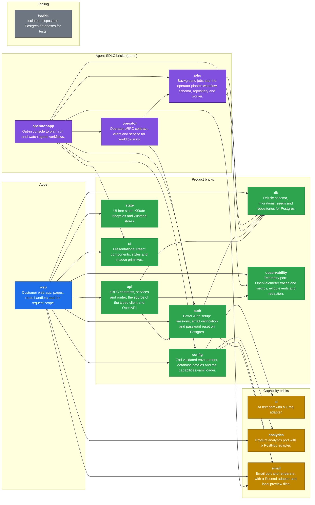

<!-- Generated by `bun run docs:generate` from every workspace package.json. Do not edit by hand. -->

# Package graph

Every workspace `package.json` declares a `brick` role and a one-line `description`. Arrows point from a package to the workspace package it depends on. `bun run docs:check` fails when this file is stale, a package lacks a valid `brick` or `description`, a dependency breaks the brick rules below (`ALLOWED_BRICK_DEPENDENCIES` in `scripts/docs/docs.ts`), or a package imports a workspace package it does not declare. Knip fails on declared dependencies that nothing imports, so every arrow is a real import.

## Brick rules

| Brick | May depend on |
| --- | --- |
| workspace | app, product, capability, agent-sdlc, tooling |
| app | product, capability, tooling |
| product | product, capability, tooling |
| capability | tooling |
| agent-sdlc | product, capability, agent-sdlc, tooling |
| tooling | product, capability, tooling |

## Packages

| Package | Brick | Purpose | Workspace dependencies | Exports |
| --- | --- | --- | --- | --- |
| [`@darkfactory/root`](../../package.json) | workspace | A modular, Postgres-first, AI-native application foundation. | `@darkfactory/api`, `@darkfactory/auth`, `@darkfactory/config`, `@darkfactory/db`, `@darkfactory/email`, `@darkfactory/jobs`, `@darkfactory/observability`, `@darkfactory/operator`, `@darkfactory/state`, `@darkfactory/testkit`, `@darkfactory/ui` | — |
| [`@darkfactory/web`](../../apps/web/package.json) | app | Customer web app: pages, route handlers and the request scope. | `@darkfactory/analytics`, `@darkfactory/api`, `@darkfactory/auth`, `@darkfactory/config`, `@darkfactory/db`, `@darkfactory/email`, `@darkfactory/observability`, `@darkfactory/state`, `@darkfactory/ui` | — |
| [`@darkfactory/api`](../../packages/api/package.json) | product | oRPC contracts, services and router; the source of the typed client and OpenAPI. | `@darkfactory/auth`, `@darkfactory/db`, `@darkfactory/observability` | `.`, `./server` |
| [`@darkfactory/auth`](../../packages/auth/package.json) | product | Better Auth setup: sessions, email verification and password reset on Postgres. | `@darkfactory/db`, `@darkfactory/email` | `./client`, `./db`, `./server`, `./types` |
| [`@darkfactory/config`](../../packages/config/package.json) | product | Zod-validated environment, database profiles and the capabilities.yaml loader. | `@darkfactory/ai`, `@darkfactory/analytics`, `@darkfactory/email` | `.`, `./database`, `./server`, `./server/capabilities` |
| [`@darkfactory/db`](../../packages/db/package.json) | product | Drizzle schema, migrations, seeds and repositories for Postgres. | — | `./schema`, `./server`, `./server/migration` |
| [`@darkfactory/observability`](../../packages/observability/package.json) | product | Telemetry port: OpenTelemetry traces and metrics, evlog events and redaction. | — | `.`, `./port`, `./redaction`, `./server/evlog`, `./server/fanout`, `./server/otel`, `./test` |
| [`@darkfactory/state`](../../packages/state/package.json) | product | UI-free state: XState lifecycles and Zustand stores. | — | `.`, `./client`, `./flow` |
| [`@darkfactory/ui`](../../packages/ui/package.json) | product | Presentational React components, styles and shadcn primitives. | — | `.`, `./avatar`, `./badge`, `./button`, `./card`, `./client/dialog`, `./client/dropdown-menu`, `./client/tabs`, `./client/theme`, `./client/toaster`, `./empty-state`, `./headings`, `./icon-button`, `./input`, `./label`, `./palettes`, `./separator`, `./skeleton`, `./stat-card`, `./status-badge`, `./styles.css`, `./textarea`, `./utilities` |
| [`@darkfactory/ai`](../../packages/ai/package.json) | capability | AI text port with a Groq adapter. | — | `.`, `./adapters`, `./server/groq`, `./test` |
| [`@darkfactory/analytics`](../../packages/analytics/package.json) | capability | Product analytics port with a PostHog adapter. | — | `.`, `./adapters`, `./server/posthog`, `./test` |
| [`@darkfactory/email`](../../packages/email/package.json) | capability | Email port and renderers, with a Resend adapter and local preview files. | — | `.`, `./adapters`, `./recipient`, `./server`, `./test` |
| [`@darkfactory/jobs`](../../packages/jobs/package.json) | agent-sdlc | Background jobs and the operator plane's workflow schema, repository and worker. | `@darkfactory/db`, `@darkfactory/observability` | `.`, `./schema/workflow`, `./server/inline`, `./server/omp`, `./server/pilot-worker`, `./server/plan-evidence`, `./server/wayfinder`, `./server/workflow-error`, `./server/workflow-repository`, `./server/workflow-runtime`, `./server/workflow-worker`, `./test`, `./workflow` |
| [`@darkfactory/operator`](../../packages/operator/package.json) | agent-sdlc | Operator oRPC contract, client and service for workflow runs. | `@darkfactory/auth`, `@darkfactory/jobs` | `.`, `./client`, `./contract`, `./server` |
| [`@darkfactory/operator-app`](../../apps/operator/package.json) | agent-sdlc | Opt-in console to plan, run and watch agent workflows. | `@darkfactory/auth`, `@darkfactory/config`, `@darkfactory/db`, `@darkfactory/email`, `@darkfactory/jobs`, `@darkfactory/operator`, `@darkfactory/ui` | — |
| [`@darkfactory/testkit`](../../packages/testkit/package.json) | tooling | Isolated, disposable Postgres databases for tests. | — | `.`, `./postgres` |
